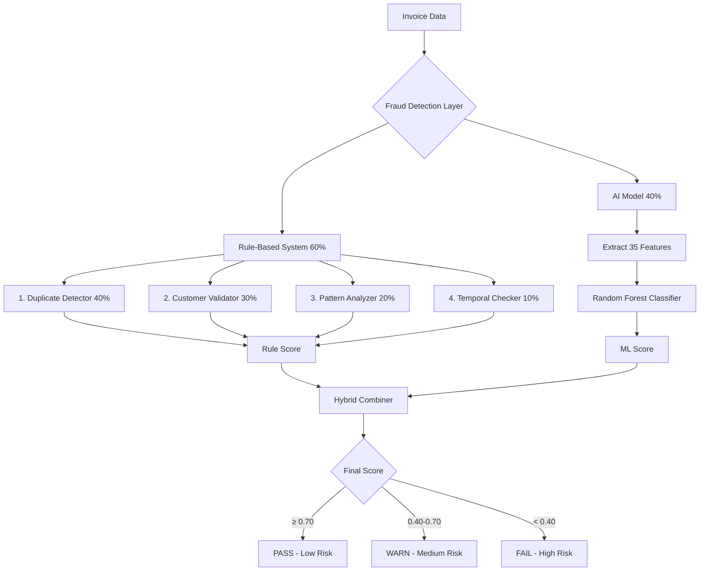

# Fraud Detection Layer (Layer 3)

## Overview

The Fraud Detection Layer is a **hybrid fraud detection system** that combines deterministic rule-based checks with machine learning to identify fraudulent invoices. It operates as the third and final layer in the MCP (Multi-Confident Pipeline) verification process.

**Key Features**:
- 🔍 **Hybrid Architecture**: 60% rule-based + 40% ML-based
- 🎯 **4 Rule Checkers**: Duplicate, Customer, Pattern, Temporal
- 🤖 **Random Forest ML**: Trained on historical fraud data
- ⚖️ **Weighted Scoring**: Intelligent combination of all signals
- 🛡️ **Fault Tolerant**: Works even without ML model

---

## 📊 Architecture



---

## 🔍 Part 1: Rule-Based Detection (60% weight)

The rule-based system runs **4 independent checkers** that each analyze different aspects of an invoice.

### 1. Duplicate Detector (40% of rules)

**Purpose**: Prevents duplicate invoice number fraud

**How it works**:
```python
# Search for duplicate invoice number in same organization
duplicate = db.invoices.find_one({
    'orgId': organization_id,
    'invoiceNumber': invoice_number,
    '_id': {'$ne': current_invoice_id}
})
```

**Scoring**:
- `1.0` = No duplicate found ✅
- `0.0` = Duplicate exists (immediate fraud indicator) ❌

**Flags**:
- `DUPLICATE_INVOICE_NUMBER: Invoice #12345 already exists`

**Why 40% weight**: Duplicates are the most definitive fraud indicator - if an invoice number already exists, it's almost certainly fraud or an error.

---

### 2. Customer Validator (30% of rules)

**Purpose**: Validate customer (issuedTo) is known or approved

**How it works** (3-tier fallback):

**Tier 1 - Approved List**:
```python
org = db.organizations.find_one({'_id': org_id})
if customer_name in org.get('approvedCustomers', []):
    return 1.0  # Pre-approved customer
```

**Tier 2 - Historical Pattern**:
```python
previous_approved = db.invoices.count({
    'orgId': org_id,
    'issuedTo': customer_name,
    'reviewDecision': 'APPROVED'
})
```

**Tier 3 - Unknown Customer**:
```python
if no_history:
    return 0.3  # Flag for review
```

**Scoring**:
| Scenario | Score | Meaning |
|----------|-------|---------|
| In approved list | 1.0 | ✅ Pre-approved |
| 5+ approved invoices | 0.9 | ✅ Established customer |
| 1-4 approved invoices | 0.7 | ⚠️ Known but limited history |
| 3+ unreviewed invoices | 0.6 | ⚠️ Some pattern exists |
| Customer name missing | 0.5 | ⚠️ Incomplete data |
| Unknown customer | 0.3 | ❌ No history found |
| Not in approved list | 0.2 | ❌ Explicitly not approved |

**Flags**:
- `CUSTOMER_MISSING: No customer name found on invoice`
- `CUSTOMER_NOT_APPROVED: Customer 'X' is not in approved customer list`
- `CUSTOMER_UNKNOWN: Unknown customer 'X' - no history found`
- `CUSTOMER_LIMITED_HISTORY: Customer 'X' has limited history (2 approved invoices)`

**Why 30% weight**: Customer relationship is a strong legitimacy indicator - legitimate businesses have established customer relationships.

---

### 3. Pattern Analyzer (20% of rules)

**Purpose**: Detect suspicious patterns in invoice data

**How it works** (4 sub-checks):

#### A. Round Amount Check (40% of pattern weight)
```python
# Very round amounts are suspicious (easy to fabricate)
if total % 1000 == 0:  # $1000, $5000, $10000
    deduction += 0.4 * 0.4

if total % 100 == 0:   # $500, $1200, $3400
    deduction += 0.2 * 0.4
```

#### B. Invoice Number Check (30% of pattern weight)
```python
# Check for suspicious invoice number patterns
if not invoice_number:
    score = 0.5  # Missing

if invoice_number in ['000', '111', 'test', 'fake', 'demo']:
    score = 0.2  # Obviously fake

if invoice_number.isdigit() and len(invoice_number) <= 3:
    score = 0.6  # Too simple: "001", "042"
```

#### C. Benford's Law Check (20% of pattern weight)
```python
# Natural invoices follow Benford's Law for first digit distribution
# First digit 1 appears ~30%, 2 appears ~18%, 9 appears ~5%
first_digit = str(total)[0]
if deviates_from_benford_distribution(first_digit):
    deduction += 0.2 * 0.2
```

#### D. Missing Fields Check (10% of pattern weight)
```python
required = ['invoiceNumber', 'issuedTo', 'total', 'invoiceDate']
missing = count_missing_fields(invoice)

if missing >= 3:
    score = 0.3  # Very incomplete
elif missing >= 2:
    score = 0.6  # Somewhat incomplete
elif missing >= 1:
    score = 0.8  # Minor issue
```

**Flags**:
- `PATTERN_ROUND: Very round amount $5,000`
- `PATTERN_INVOICE_NUMBER: Suspicious invoice number format 'test'`
- `PATTERN_MISSING_FIELDS: Missing or incomplete invoice fields`

**Why 20% weight**: Patterns are supportive evidence but not definitive - legitimate invoices can sometimes have these patterns.

---

### 4. Temporal Checker (10% of rules)

**Purpose**: Catch date-related anomalies

**How it works**:

#### A. Future Date Check
```python
if invoice_date > datetime.now():
    deduction += 0.5
    flag = "TEMPORAL_FUTURE_DATE: Invoice dated in the future"
```

#### B. Too Old Check
```python
org_created = org.get('createdAt')
if invoice_date < org_created:
    deduction += 0.5
    flag = "TEMPORAL_TOO_OLD: Invoice older than organization"
```

#### C. Excessive Frequency Check
```python
same_day_count = count_invoices_on_date(org_id, invoice_date)
if same_day_count > 10:
    deduction += 0.3
    flag = "TEMPORAL_EXCESSIVE_FREQUENCY: 10+ invoices on same day"
```

**Scoring**: `1.0 - total_deductions`

**Flags**:
- `TEMPORAL_FUTURE_DATE`
- `TEMPORAL_TOO_OLD`
- `TEMPORAL_EXCESSIVE_FREQUENCY`

**Why 10% weight**: Temporal issues are usually minor or can have legitimate explanations (batch processing, back-dated invoices).

---

### Rule-Based Score Calculation

```python
rule_score = (
    duplicate_score  * 0.40 +  # Most critical
    customer_score   * 0.30 +  # Very important
    pattern_score    * 0.20 +  # Supporting evidence
    temporal_score   * 0.10    # Minor indicator
)
```

**Example**:
```python
# Invoice with no duplicate, unknown customer, missing fields, valid date
rule_score = (1.0 * 0.40) + (0.3 * 0.30) + (0.4 * 0.20) + (1.0 * 0.10)
           = 0.40 + 0.09 + 0.08 + 0.10
           = 0.67  # WARN (medium risk)
```

---

## 🤖 Part 2: AI-Based Detection (40% weight)

The AI model is a **Random Forest classifier** trained on historical invoice data to detect patterns that rules might miss.

### What the AI Does

**Learns patterns from data**:
- Novel fraud techniques
- Subtle feature combinations
- Organization-specific fraud patterns
- Temporal trends and seasonality

**Complements rules by catching**:
- Invoices that look fine individually but match fraud patterns
- Sophisticated fraud that passes rule checks
- Emerging fraud techniques not yet codified in rules

### Feature Extraction (35 Features)

The AI extracts **35 numerical features** from each invoice:

#### 1. Amount Features (10)
```python
total           # Total invoice amount
subtotal        # Subtotal before tax
tax             # Tax amount
tax_ratio       # Tax/Total ratio
amount_log      # Log-transformed total
is_round_100    # Binary: amount is multiple of 100
is_round_1000   # Binary: amount is multiple of 1000
is_round_500    # Binary: amount is multiple of 500
has_cents       # Binary: has decimal cents
cents_value     # The decimal portion
```

#### 2. Invoice Number Features (4)
```python
inv_num_length      # Length of invoice number
inv_num_has_prefix  # Binary: starts with INV/INVOICE/PO/REF
inv_num_is_numeric  # Binary: purely numeric
inv_num_missing     # Binary: invoice number missing
```

#### 3. Customer Features (3)
```python
issued_to_length     # Length of customer name
issued_to_missing    # Binary: customer missing
issued_to_is_generic # Binary: "cash", "unknown", etc.
```

#### 4. Date Features (7)
```python
date_missing   # Binary: date missing
days_old       # Days since invoice date
is_future      # Binary: date in future
is_weekend     # Binary: invoiced on weekend
month          # Month number (1-12)
day_of_week    # Day of week (0-6)
is_month_end   # Binary: day >= 28
```

#### 5. Line Item Features (9)
```python
line_item_count         # Number of line items
has_line_items          # Binary: has line items
avg_line_item_value     # Average value per line item
max_quantity            # Highest quantity
avg_quantity            # Average quantity
max_unit_price          # Highest unit price
avg_unit_price          # Average unit price
calculation_mismatches  # Count of qty×price ≠ amount errors
single_item_dominance   # Largest item / total ratio
has_high_quantity       # Binary: any item qty > 100
```

#### 6. Completeness Features (2)
```python
missing_fields_count  # Count of missing required fields (0-4)
completeness_score    # 1 - (missing_fields_count / 4)
```

### Random Forest Prediction

```python
from app.engines.fraud.feature_extractor import FraudFeatureExtractor
from app.engines.fraud.model_loader import get_fraud_model

# Extract features
extractor = FraudFeatureExtractor()
features = extractor.extract_feature_vector(invoice_data)
# Returns: [5000.0, 5000.0, 0.0, 0.0, ..., 0.25]  # 35 numbers

# Load model and predict
model = get_fraud_model()
if model:
    fraud_proba = model.predict_proba([features])[0][1]
    # fraud_proba = 0.75 means 75% chance of fraud
    
    ml_score = 1 - fraud_proba  # Convert to score
    # ml_score = 0.25
```

**How Random Forest Works**:
1. **100 decision trees** each make a prediction
2. Each tree learned different patterns from training data
3. Trees vote on "fraud" vs "legitimate"
4. Final probability = fraction of trees voting "fraud"

**Example Tree Logic**:
```
Tree #37:
  if missing_fields_count > 2:
    if is_round_1000 == 1:
      if issued_to_missing == 1:
        → FRAUD (confidence: 0.95)
      else:
        → LEGITIMATE (confidence: 0.60)
```

### ML Training Data

**Dataset Source**: Auditor-reviewed invoices from MongoDB

**Required Fields**:
```javascript
{
  invoiceNumber: String,
  invoiceDate: Date,
  totalAmount: Number,
  issuedTo: String,
  lineItems: Array,
  reviewDecision: String  // "approved" or "rejected" ← LABEL
}
```

**Labels**:
- `reviewDecision: "approved"` → Legitimate (label = 0)
- `reviewDecision: "rejected"` → Fraud (label = 1)

**Minimum Requirements**:
- 500+ labeled invoices
- 25+ fraud examples
- Diverse examples across customers, amounts, dates

**Training Process**:
```bash
# Run training script
python scripts/train_fraud_model.py

# With custom thresholds
python scripts/train_fraud_model.py --min-samples 200 --min-fraud 10
```

See [`train_fraud_model.py`](file:///c:/Users/lNooisYl/Documents/IT/WEBDEV/FinShield/AI_SERVICE/scripts/train_fraud_model.py) for details.

---

## ⚖️ How Rules and AI Connect

### Hybrid Score Combination

```python
# Step 1: Always calculate rule-based score
rule_score = (
    duplicate_score * 0.40 +
    customer_score  * 0.30 +
    pattern_score   * 0.20 +
    temporal_score  * 0.10
)

# Step 2: Try to get ML score (if model exists)
model = get_fraud_model()
if model:
    features = extract_feature_vector(invoice_data)
    fraud_proba = model.predict_proba([features])[0][1]
    ml_score = 1 - fraud_proba
    
    # Step 3: Combine with weighted average
    final_score = (rule_score * 0.60) + (ml_score * 0.40)
else:
    # No model available → rules only
    final_score = rule_score
```

### Why 60/40 Split?

**60% Rules**:
- Always available (no training needed)
- Explainable and transparent
- Catch definitive fraud (duplicates, missing data)
- Provide safety baseline

**40% AI**:
- Learns novel patterns
- Adapts to your specific organization
- Catches subtle combinations
- Improves over time with more data

**Together**: Best of both worlds - reliability + adaptability

---

## 📊 Complete Example: Hybrid Detection

### Input Invoice
```json
{
  "invoiceNumber": "",
  "invoiceDate": "2026-02-04",
  "totalAmount": 5000.00,
  "issuedTo": "",
  "lineItems": []
}
```

### Step 1: Rule-Based Analysis

| Check | Score | Weight | Contribution | Reason |
|-------|-------|--------|--------------|--------|
| **Duplicate** | 1.0 | 0.40 | 0.40 | No duplicate found ✅ |
| **Customer** | 0.5 | 0.30 | 0.15 | Customer name missing ⚠️ |
| **Pattern** | 0.4 | 0.20 | 0.08 | Missing inv#, round amount ❌ |
| **Temporal** | 1.0 | 0.10 | 0.10 | Valid date ✅ |
| **RULE SCORE** | | | **0.63** | |

**Rule Flags**:
- `CUSTOMER_MISSING: No customer name found on invoice`
- `PATTERN_INVOICE_NUMBER: Suspicious invoice number format ''`
- `PATTERN_MISSING_FIELDS: Missing or incomplete invoice fields`

### Step 2: AI Analysis

**Feature Vector** (35 values):
```python
[
  5000.0,  # total
  5000.0,  # subtotal
  0.0,     # tax
  0.0,     # tax_ratio
  8.517,   # amount_log
  1.0,     # is_round_100 ← RED FLAG
  1.0,     # is_round_1000 ← RED FLAG
  0.0,     # is_round_500
  0.0,     # has_cents
  0.0,     # cents_value
  0.0,     # inv_num_length
  0.0,     # inv_num_has_prefix
  0.0,     # inv_num_is_numeric
  1.0,     # inv_num_missing ← RED FLAG
  0.0,     # issued_to_length
  1.0,     # issued_to_missing ← RED FLAG
  0.0,     # issued_to_is_generic
  0.0,     # date_missing
  20.0,    # days_old
  0.0,     # is_future
  0.0,     # is_weekend
  2.0,     # month
  3.0,     # day_of_week
  0.0,     # is_month_end
  0.0,     # line_item_count ← RED FLAG
  0.0,     # has_line_items
  5000.0,  # avg_line_item_value
  1.0,     # max_quantity
  1.0,     # avg_quantity
  5000.0,  # max_unit_price
  5000.0,  # avg_unit_price
  0.0,     # calculation_mismatches
  1.0,     # single_item_dominance ← RED FLAG
  0.0,     # has_high_quantity
  3.0,     # missing_fields_count ← RED FLAG
  0.25     # completeness_score ← RED FLAG
]
```

**Random Forest Prediction**:
- 75 trees vote FRAUD
- 25 trees vote LEGITIMATE
- **Fraud Probability**: 0.75 (75%)
- **ML Score**: 1 - 0.75 = **0.25**

**ML Flags**:
- `ML_HIGH_FRAUD_RISK: 75.0% fraud probability`

### Step 3: Hybrid Combination

```python
final_score = (0.63 × 0.60) + (0.25 × 0.40)
            = 0.378 + 0.100
            = 0.478
```

### Step 4: Final Verdict

**Score**: 0.478  
**Threshold**: Between 0.40 and 0.70  
**Verdict**: `WARN` (Medium Risk - Needs Auditor Review)

**All Flags Combined**:
- `CUSTOMER_MISSING: No customer name found on invoice`
- `PATTERN_INVOICE_NUMBER: Suspicious invoice number format ''`
- `PATTERN_MISSING_FIELDS: Missing or incomplete invoice fields`
- `ML_HIGH_FRAUD_RISK: 75.0% fraud probability`

---

## 🎯 Why Hybrid is Better Than Rules or AI Alone

### Scenario 1: Clever Fraud (AI Catches What Rules Miss)

**Invoice appears legitimate**:
```json
{
  "invoiceNumber": "INV-2024-0847",
  "invoiceDate": "2026-01-15",
  "totalAmount": 3847.23,
  "issuedTo": "Acme Corp",
  "lineItems": [{"description": "Services", "amount": 3847.23}]
}
```

**Rule-Based**: 0.85 ✅ (passes all checks)
- No duplicate
- Known customer
- Valid invoice number
- Not a round amount

**AI Sees Subtle Patterns**:
- Invoice number length unusual for this org
- Amount suspiciously close to round (3847.23 ≈ 3850)
- Invoiced on Sunday (rare)
- Single line item dominance = 1.0
- Days old = 20 (faster than typical 30-45 day lag)

**AI Score**: 0.35 ❌ (fraud probability 0.65)

**Hybrid**: 0.85 × 0.6 + 0.35 × 0.4 = **0.65** → `WARN` ⚠️

**Result**: AI caught sophisticated fraud that rules missed!

---

### Scenario 2: Incomplete but Legitimate (Rules Prevent False Positive)

**Invoice from established customer missing some fields**:
```json
{
  "invoiceNumber": "PO-12345",
  "invoiceDate": "2026-02-01",
  "totalAmount": 1234.56,
  "issuedTo": "Long-time Customer Inc",
  "lineItems": []  // Missing line items
}
```

**Rule-Based**: 0.70 ⚠️
- No duplicate (1.0)
- Customer has 50+ approved invoices (0.9)
- Missing line items, minor pattern issues (0.6)
- Valid date (1.0)

**AI Sees Missing Data**:
- Line item count = 0 (suspicious)
- Missing fields trigger model
- **AI Score**: 0.30 ❌

**Hybrid**: 0.70 × 0.6 + 0.30 × 0.4 = **0.54** → `WARN` ⚠️

**Result**: Rules keep score reasonable, preventing outright rejection of legitimate invoice.

---

### Scenario 3: Obvious Duplicate (Rules Dominate)

**Exact duplicate invoice**:
```json
{
  "invoiceNumber": "INV-12345",  // Already exists!
  "invoiceDate": "2026-02-04",
  "totalAmount": 2500.00,
  "issuedTo": "Valid Customer",
  "lineItems": [...]
}
```

**Rule-Based**: 0.0 ❌ (duplicate score kills it)

**AI**: 0.80 ✅ (invoice looks fine in isolation)

**Hybrid**: 0.0 × 0.6 + 0.80 × 0.4 = **0.32** → `FAIL` ❌

**Result**: Rules' strong signal overrides AI's false confidence.

---

## 🔄 Model Lifecycle

### Phase 1: Initial Deployment (Rules Only)
```
No ML model yet → 100% Rule-Based
- Still effective!
- Catches duplicates, missing fields, suspicious patterns
- Provides baseline protection
```

### Phase 2: Data Collection
```
Auditors review flagged invoices → mark as approved/rejected
Each review becomes training data
Target: 500+ labeled invoices with 25+ fraud examples
```

### Phase 3: First Training
```bash
python scripts/train_fraud_model.py
```
```
✅ Fetched 1,200 labeled invoices
✅ Trained model: 85% accuracy, 78% precision, 72% recall
✅ Model saved to S3 and cached
✅ Hybrid mode activated
```

### Phase 4: Hybrid Operation
```
60% Rules + 40% AI
- AI learns organization-specific patterns
- Adapts to seasonal trends
- Improves with more data
```

### Phase 5: Continuous Improvement
```
Monthly automated retraining
- New fraud examples improve detection
- Model adapts to new fraud techniques
- Accuracy improves over time
```

---

## 🛠️ Configuration & Files

### Key Files

| File | Purpose |
|------|---------|
| [`fraud.py`](file:///c:/Users/lNooisYl/Documents/IT/WEBDEV/FinShield/AI_SERVICE/app/pipelines/verification/stages/fraud.py) | Main fraud detection layer orchestrator |
| [`duplicate_detector.py`](file:///c:/Users/lNooisYl/Documents/IT/WEBDEV/FinShield/AI_SERVICE/app/engines/fraud/duplicate_detector.py) | Check for duplicate invoices |
| [`customer_validator.py`](file:///c:/Users/lNooisYl/Documents/IT/WEBDEV/FinShield/AI_SERVICE/app/engines/fraud/customer_validator.py) | Validate customer approval |
| [`pattern_analyzer.py`](file:///c:/Users/lNooisYl/Documents/IT/WEBDEV/FinShield/AI_SERVICE/app/engines/fraud/pattern_analyzer.py) | Detect suspicious patterns |
| [`temporal_checker.py`](file:///c:/Users/lNooisYl/Documents/IT/WEBDEV/FinShield/AI_SERVICE/app/engines/fraud/temporal_checker.py) | Check date anomalies |
| [`feature_extractor.py`](file:///c:/Users/lNooisYl/Documents/IT/WEBDEV/FinShield/AI_SERVICE/app/engines/fraud/feature_extractor.py) | Extract 35 ML features |
| [`model_loader.py`](file:///c:/Users/lNooisYl/Documents/IT/WEBDEV/FinShield/AI_SERVICE/app/engines/fraud/model_loader.py) | Load ML model from S3/cache |
| [`train_fraud_model.py`](file:///c:/Users/lNooisYl/Documents/IT/WEBDEV/FinShield/AI_SERVICE/scripts/train_fraud_model.py) | Training script |

### Model Storage

**Priority Order**:
1. **In-memory cache** (~1ms) - Fastest
2. **S3 bucket** (~150ms) - Cloud storage: `s3://finshield-models/fraud_model_rf.pkl.gz`
3. **Local file** (~50ms) - Fallback: `models/fraud_model_rf.pkl`
4. **None** - Use rules-only mode

### Training Configuration

```python
# In train_fraud_model.py
MIN_SAMPLES = 500       # Minimum invoices needed
MIN_FRAUD_SAMPLES = 25  # Minimum fraud examples
MAX_SAMPLES = 50000     # Memory cap

MODEL_PARAMS = {
    'n_estimators': 100,
    'max_depth': 10,
    'class_weight': 'balanced',
    'random_state': 42,
    'n_jobs': -1
}

MIN_ACCURACY = 0.80
MIN_PRECISION = 0.70
MIN_RECALL = 0.60
```

---

## 📈 Best Practices

### For Better Fraud Detection

1. **Build Quality Training Data**
   - Have auditors consistently review flagged invoices
   - Ensure clear criteria for "approved" vs "rejected"
   - Aim for at least 1,000 labeled examples
   - Maintain 5-15% fraud ratio in dataset

2. **Maintain Approved Customer Lists**
   - Add `approvedCustomers` array to organization documents
   - Update regularly as you onboard new customers
   - Consider automatic approval after 5+ successful invoices

3. **Regular Retraining**
   - Monthly retraining captures new fraud patterns
   - More data = better accuracy
   - Schedule automated retraining via cron/Task Scheduler

4. **Monitor Performance**
   - Track false positive rate (flagged but legitimate)
   - Track false negative rate (fraud that passed)
   - Adjust thresholds if needed

### For Developers

1. **Feature Engineering**
   - Add domain-specific features for your industry
   - Both `feature_extractor.py` and `train_fraud_model.py` must match

2. **Hyperparameter Tuning**
   - Experiment with `MODEL_PARAMS` in training script
   - Try different algorithms (XGBoost, Neural Networks)
   - Use cross-validation for robust evaluation

3. **Testing**
   - Use `--dry-run` flag for experimentation
   - Keep backups of well-performing models
   - Version control your training configurations

---

## 💡 Key Takeaways

1. **Hybrid > Rules or AI Alone**
   - Rules provide reliability and explainability
   - AI provides adaptability and novel pattern detection
   - Together = robust fraud protection

2. **AI Complements, Doesn't Replace Rules**
   - Rules catch definitive fraud (duplicates, missing data)
   - AI catches subtle patterns and sophisticated fraud
   - 60/40 split balances both strengths

3. **Works Without ML Model**
   - System operates with rules-only initially
   - Add ML when you have sufficient training data
   - Fault-tolerant: if model fails, rules still protect

4. **Continuously Improving**
   - Each auditor review improves training data
   - Monthly retraining keeps model current
   - Adapts to your organization's specific fraud patterns

---

**The Fraud Detection Layer provides comprehensive protection through intelligent combination of deterministic rules and adaptive machine learning!** 🛡️
