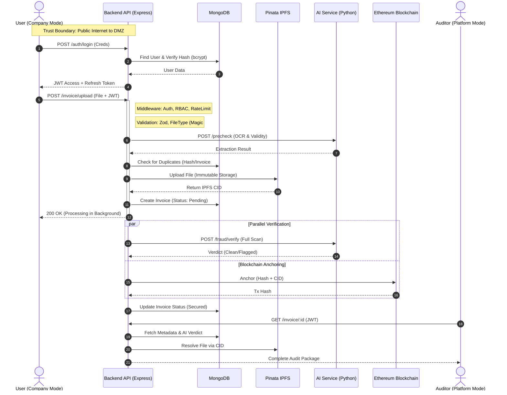

# Security Audit - Category 4: Secure Design & Data Flow

**Status:** ✅ Data Flow Diagram Documented

## System Data Flow Diagram (DFD)

The following diagram illustrates the flow of sensitive data across Trust Boundaries (User, Backend, Database, External Services).

## Key Security Controls in Flow

1.  **Trust Boundaries**: 
    - All inputs from `User` crossing into `API` are treated as untrusted.
    - Validated via `validate.middleware.js` and `fileType.middleware.js` immediately upon entry.

2.  **Least Privilege**:
    - `User` can only upload to their own Organization (`requireSameOrgParam`).
    - `Auditor` has read-only access to specific compliance data.

3.  **Data Minimization**:
    - Files are offloaded to **IPFS**; only CIDs and Hashes are stored in MongoDB.
    - Passwords are never returned in `User Data` flow (`select: false`).

4.  **Immutability**:
    - The `Ethereum Blockchain` step ensures that once a document footprint (Hash) is anchored, the document's existence and integrity at that point in time cannot be altered.
